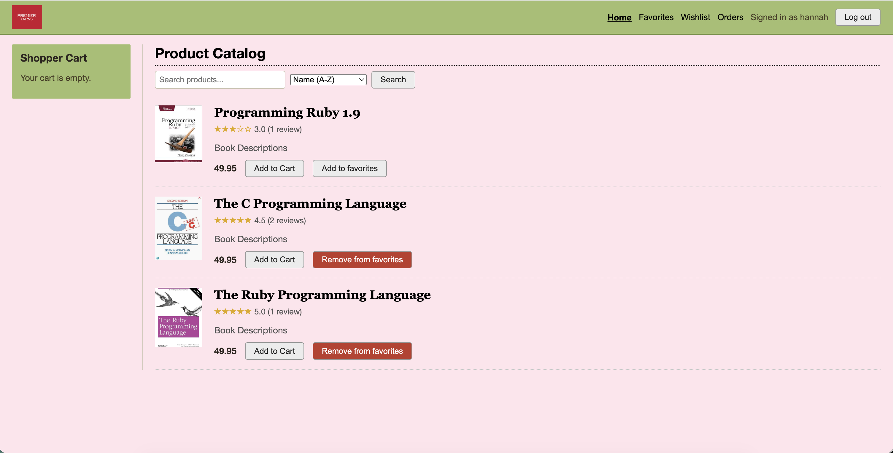
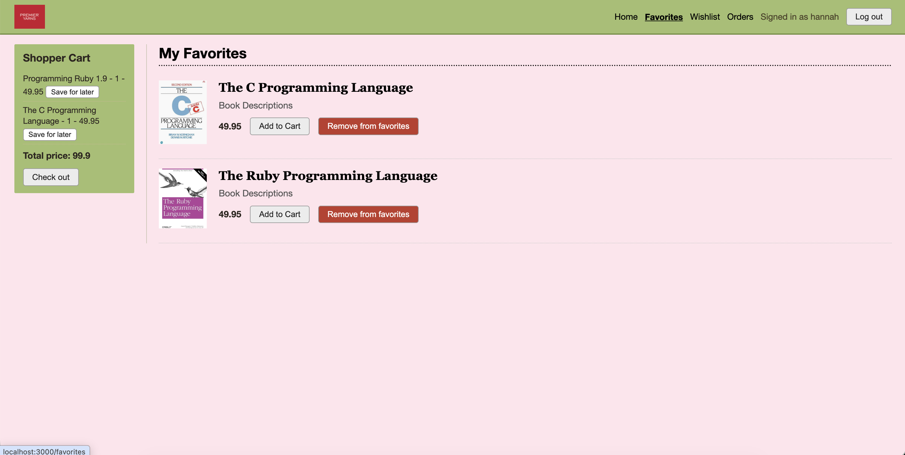
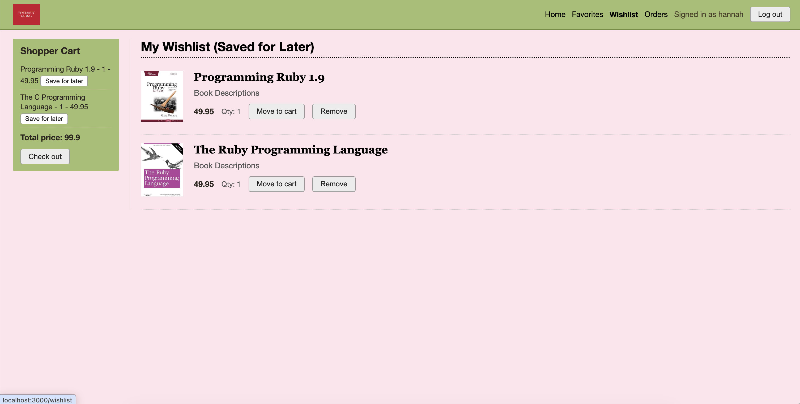
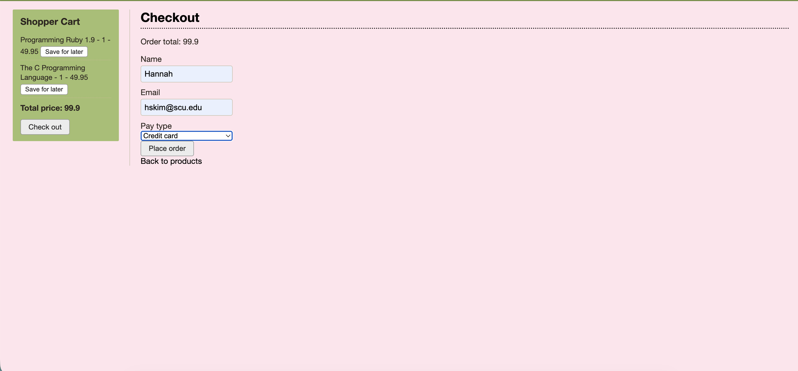
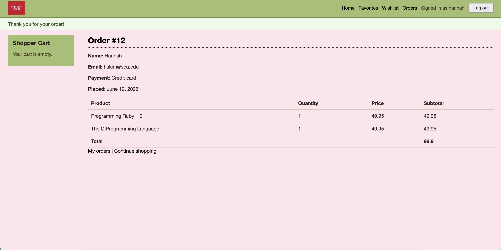
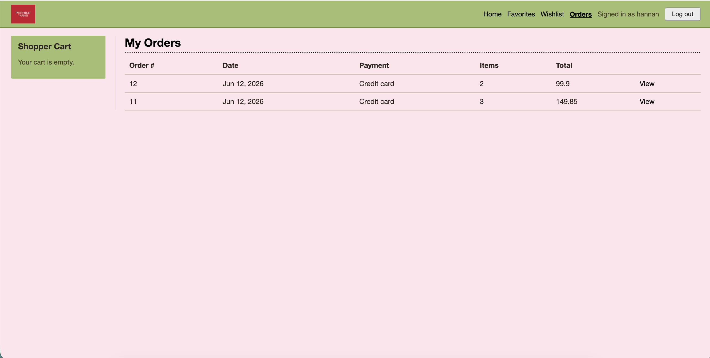

# Programming Textbook Store - Hannah Kim
This website allows for the user to create an account, save certain textbooks to your favorites, move textbooks from the cart to your wishlist, order textbooks, and keep track of past orders. Users can also leave reviews with ratings and descriptions. Admin users can see all of the orders, while users can only see their own past orders. This project is an add on to the in class demo we were working on together.

## Main Features

- User accounts — sign up, log in, log out, and sessions
- Product catalog — see all textbooks on the home page, each with an image, price, description, and average rating
- Search & sorting — search products by name or description and sort by name or price on the home page
- Shopping cart — add textbooks to a session-based cart shown in the sidebar on every page
- Reviews— users can write, edit, and delete their own reviews (rating + comment)
- Favorites — users can add and remove products to a personal favorites list from the home page
- Wishlist (Save for Later) — move an item from your cart to a wishlist to buy later, then move it back to the cart when ready (the quantities are preserved)
- Orders & checkout — check out the cart into an order (name, email, payment type). Each order belongs to the user who placed it, can be checked by user or admin/
- Order history & authorization — users can view only their own past orders; an admin user can view all of the orders. Product create/edit/delete is restricted to admins.

### Two full-CRUD resources
- Product — full Create / Read / Update / Delete (admin-managed).
- Review — full Create / Read / Update / Delete, logged-in users manage only their own reviews.

### Additional major features
- Product Reviews (Feature 1) — ratings + comments, with an average rating shown on each product page (needed also for the CRUD resource)
- Wishlist / Favorites (Feature 2) — favorite products and a "Save for Later" wishlist that moves items between the cart and the list.

## Models and Associations

| Model | Key fields | Associations |
|-------|-----------|--------------|
| **User** | `username`, `password_digest`, `admin` | `has_many :reviews`, `:favorites`, `:favorited_products` (through favorites), `:orders`, `:wishlist_items` |
| **Product** | `name`, `description`, `image`, `price` | `has_many :cartitems`, `:reviews`, `:favorites` |
| **Review** | `rating`, `comment` | `belongs_to :user`, `:product` |
| **Favorite** | (join model) | `belongs_to :user`, `:product` |
| **WishlistItem** | `quantity` | `belongs_to :user`, `:product` |
| **Order** | `name`, `email`, `pay_type` | `belongs_to :user`, `has_many :cartitems` |
| **Cart** | (session-based) | `has_many :cartitems` |
| **Cartitem** | `quantity` | `belongs_to :cart`, `:order` (both optional), `:product` |

Validation:
- `Product` requires name/description/image/priceprice `>= 0.01`, unique name, and an image filename ending in `.gif/.jpg/.png`
- `Review` rating is 1–5
- `Order` requires a valid email and a payment type from the allowed list
- `User` requires a unique 3–30 character username
- `Favorite` and `WishlistItem` are unique per user+product.

## How to run the application

### 1. Start with installing the dependencies.
bundle install

### 2. Setup the database.
bin/rails db:migrate
bin/rails db:seed

### 3. Start the server
bin/rails server

Then open http://localhost:3000 in the browser.

## How to log in as sample user / admin

After running `rails db:seed`, these accounts are available (usernames are stored lowercase; the password for all is `password`):

| Username | Password | Role |
|----------|----------|------|
| `admin`  | `password` | Admin — can manage products and view all orders |
| `hannah` | `password` | Regular user (has a sample order, favorites, and a wishlist item) |
| `yuan`   | `password` | Regular user |

## Screenshots
### Home

### Favorites

### Wishlist

### Checkout

### Order Confirmation

### Order

## Known limitations

- There is no order editing or cancellation after checkout
- There is no real payment method, just a drop down box option. 
- Product images are referenced by filename and must already exist in the app's images. There is no image upload for the admin or reviews.

